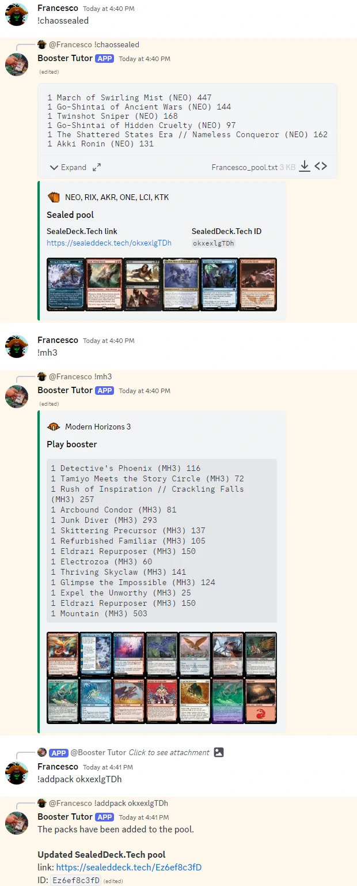

# Booster Tutor

[](https://github.com/fverdoja/booster-tutor/actions/workflows/python.yml)
[](https://ko-fi.com/boostertutor)
[](https://discord.com/api/oauth2/authorize?client_id=790677464355045396&permissions=274878155840&scope=bot)

A Discord bot to generate *Magic: the Gathering* (MTG) boosters and sealed pools



## Usage

The bot responds to the following commands:

### Random packs

* `!random`: generates a random pack from the whole history of Magic
* `!standard`: generates a random standard pack
* `!explorer`: generates a random explorer pack
* `!historic`: generates a random (non-alchemy) historic pack
* `!chaossealed`: generates 6 random (non-alchemy) historic packs
* `!from {setcodes}`: generates random packs from a list of sets separated by
  "|" (e.g., `!from inv|pls|apc` generates one pack at random from either
  *Invasion*, *Planeshift*, or *Apocalypse*)

### Set-specific packs

* `!set {setcode}` or `!{setcode}`: generates a pack from the indicated set
  (e.g., `!znr` generates a *Zendikar Rising* pack)
* `!sealed {setcode}` or `!{setcode}sealed`: generates 6 packs from the
  indicated set (e.g., `!znrsealed` generates 6 *Zendikar Rising* packs)
* `!box {setcode}` or `!{setcode}box`: generates a draft boooster box from the
  indicated set (e.g., `!znrbox` generates 36 *Zendikar Rising* packs)
* `!collector {setcode}`: generates a collector pack from the indicated set
  (e.g., `!collector znr` generates a *Zendikar Rising* collector booster)
* `!arena {setcode}` or `!a-{setcode}`: generates an arena draft pack from the
  indicated set (e.g., `!arena znr` generates a *Zendikar Rising* arena draft
  booster)
* `!pool {setcodes}`: Generates a a pack each from a list of sets separated by
  "|" (e.g., `!pool inv|pls|apc` generates one pack each from *Invasion*,
  *Planeshift*, or *Apocalypse*).

### *Jumpstart* decks

* `!jmp`: generates a ramdom *Jumpstart* deck (without Arena replacements)
* `!a-jmp`: generates a ramdom *Jumpstart* deck (with Arena replacements)
* `!j22`: generates a ramdom *Jumpstart 2022* deck

### CubeCobra cube packs

* `!cube cube_id`: generates a pack from the cube indicated by the CubeCobra
  Cube ID `cube_id`
* `!cubesealed cube_id`: generates 6 packs from the cube indicated by the
  CubeCobra Cube ID `cube_id`

#### Cube pack formats

By default, the bot generates packs randomly taking 15 cards from the cube, with
no repetition, unless the cube contains multiples of a card. No color or rarity
balance is attempted on cube packs.

The bot is also able to generate different pack formats, by using tags and the
*custom draft format* feature on CubeCobra. If your cube has a custom draft
format, configured on CubeCobra using **only tags**, and you have tagged all
cards in the cube accordingly, the bot will create a pack with slots following
the given tag. Morevover, if you set up the custom draft format to allow any
number of copies of a card, the bot will respect that setting as well. **Note:**
the bot will only follow the first pack of the first custom draft format setup
on CubeCobra.

### SealedDeck.Tech integration

Whenever a command generates more than one pack, a
[SealedDeck.Tech](https://sealeddeck.tech) link and ID are attached. The link
goes to a sealed pool containing the generated cards. Moreover, the bot answers
the following command:

* `!addpack xyz123`: if issued replying to packs generated by the bot, adds
  those packs to the previously generated
  [SealedDeck.Tech](https://sealeddeck.tech) pool with ID `xyz123`

### Help

You can ask the bot the list of commands by typing `!help`, or get help on a
specific command with `!help {command_name}`.

### Additional general parameters

* While replying to any command, the bot will mention the user who issued it,
unless the command is followed by a mention, in which case the bot will mention
that user instead. For example, `!znr @user#1234` has the bot mention
*user#1234* (instead of you) in its reply.

* Most of the pack-generating non-sealed commands can take a number to generate
  more than one pack. For example `!random 3` will generate 3 random packs.

## Host your own bot

### Requirements

The bot should works on `python 3.9+`. All dependencies are listed in
`requirements.txt` and should be installed for the bot to run.

#### Development

If you are interested in running the tests or doing development, you should also
install the dependencies in `requirements-dev.txt`. The easiest way to setup
your environment correctly is by using the provided `devcontainer.json`
configuration file.

### Run the bot

To host your own bot you will need a Discord token. Once you have procured those
for yourself, follow these steps:

* Make a `config.yaml` file (see `config_template.yaml` for help)

* Download MTGJson data by running:

```bash
  python -m boostertutor mtgjson
```

* Run the bot:

```bash
  python -m boostertutor
```

For a complete list of commands and parameters you can check the help by
running:

```bash
  python -m boostertutor -h
```

## Under the hood

### Booster data source

All booster data comes from [mtgjson](https://mtgjson.com), an open-source
project that catalogs all MTG cards.

### Color balancing

MTG boosters are not purely random, mathematically speaking. They are generated
by collating together cards from print sheets in specific orders, this is what
is kind of known in the limited world as "print run". How this is performed is
not publicly disclosed by Wizards, but in practice the process generates
boosters which enforce some desirable properties for limited play (like color
balancing and no duplicates).

For draft boosters, to try to produce boosters which *feel* similar to real MTG
draft boosters, Booster Tutor uses what is known as *Reuben's algorithm*.

> *Reuben's algorithm*
>
> First, generate a booster using a pure random algorithm, then check against
> the following rules, and if any of the rules aren't met, generate a new
> booster. Repeat until a booster that conforms to the rules is generated. The
> rules are:
>
> * A pack must never have more than 4 commons of the same color
> * A pack must have at least 1 common card of each color
> * A pack must have at least 1 common creature
> * A pack must never have more than 2 uncommons of the same color
> * A pack must never have repeated cards

To avoid infinite loops in presence of corner cases, Booster Tutor attempts at
balancing packs with *Reuben's algorithm* up to a maximum number of iterations
(default: 100).

Play boosters, Collector boosters, and some other specific boosters (for example
*Mystery Boosters*) are not balanced. Information on whether a pack should be
balanced or not is obtained from the metadata by [mtgjson](https://mtgjson.com).

## Credits

* Of course, huge thanks to [mtgjson](https://mtgjson.com)
* Card images are taken from [Scryfall](https://scryfall.com)
* Thanks to [SealedDeck.Tech](https://sealeddeck.tech) for working with me on
  integrating Booster Tutor with their tool
* Part of my data reading implementation is inspired by
  [pymtgjson](https://pythonhosted.org/mtgjson)
* An [interesting
  discussion](https://gist.github.com/fenhl/8d163733ab92ed718d89975127aac152#simulated-collation)
  over a few approaches on color balancing in MTG boosters from where I took
  *Reuben's algorithm*
* *Wizards of the Coast*, *Magic: The Gathering*, and their logos are
  trademarks of Wizards of the Coast LLC in the United States and other
  countries. © 1993-2023 Wizards. All Rights Reserved. Booster Tutor may use
  the trademarks and other intellectual property of Wizards of the Coast LLC,
  which is permitted under Wizards' Fan Site Policy. For more information about
  Wizards of the Coast or any of Wizards' trademarks or other intellectual
  property, please visit their [website](https://company.wizards.com/).
